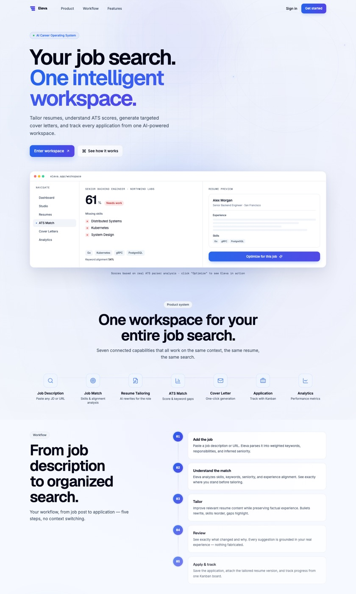

# Eleva — AI-Powered Career Workspace

[](LICENSE.md)
[](https://nextjs.org)
[](https://www.typescriptlang.org)
[](https://supabase.com)
[](https://www.docker.com)
[](https://vercel.com)

> Most resume builders stop after creating a document. Eleva is an AI-powered career workspace: tailor resumes to job descriptions, analyze ATS compatibility, generate cover letters, and track every application — in one place.

## Live Demo

**https://eleva-chandu954.vercel.app**

Try it with **Google Sign-In** — no credit card, no setup.

---

## Screenshots



> Dashboard, Studio, and Resume Editor screenshots are captured from the live app (requires sign-in).

---

## Why Eleva?

Traditional resume tools are static documents. Eleva treats your job search as a **workflow**:

1. **Upload or build** a base resume once.
2. **Paste a real job description** into the Studio.
3. Eleva **extracts, scores, and tailors** — then generates the cover letter and tracks the application.

It's a pipeline, not a form.

---

## Features

- **Multi-Provider AI** — Switch between OpenAI, Claude, Gemini, OpenRouter, NVIDIA, or local Ollama models. Single-provider mode ensures all requests use your chosen model. Auto mode routes each task to the best model within your provider's family.
- **Resume Editor** — Rich text editor with TipTap, drag-and-drop sections, real-time preview, PDF/DOCX export.
- **ATS Optimizer** — Score your resume against job descriptions, get keyword suggestions, and targeted improvement recommendations.
- **Cover Letter Generator** — AI-powered cover letters tailored to specific job descriptions.
- **Prompt Studio** — Create, version, and manage custom AI prompts for resume operations.
- **Analytics Dashboard** — Track AI usage, resume scores, application activity, and interview tracking.
- **Pipeline Studio** — Run a full AI pipeline: extract skills → analyze job fit → score ATS → generate cover letter.
- **Kanban Board** — Track job applications through your pipeline.
- **Subscription Management** — Stripe integration with free/pro plans and gated features.

---

## Architecture

```
Browser
   │
   ▼
Next.js App Router (Server-first)
   │
   ├── Server Actions (data mutations)
   └── API Routes (chat, export, webhooks, health)
            │
            ▼
      Validation (Zod)
            │
            ▼
       AI Router
   ├── Cache
   ├── Rate Limiter (Redis)
   ├── Retry + Fallback
   └── Providers
        ├── OpenRouter
        ├── OpenAI
        ├── Anthropic
        ├── Gemini
        ├── NVIDIA
        └── Ollama (local)
            │
            ▼
        Supabase
   ├── Auth (RLS-enforced)
   ├── PostgreSQL
   ├── Storage
   └── Activity Logs
```

### AI Pipeline Flow

```
Resume ──► Job Description
              │
              ▼
      AI Extraction
              │
              ▼
        ATS Analysis
              │
              ▼
      Resume Tailoring
              │
              ▼
      Cover Letter
              │
              ▼
      Export (PDF/DOCX)
```

---

## Production Ready

- ✅ Authentication — Supabase Auth (Google OAuth + email) with SSR session handling
- ✅ Row Level Security — per-user data isolation on every table
- ✅ Validation — Zod schemas on all API inputs and AI outputs
- ✅ Standardized API Errors — consistent `{ success, code, message, requestId }` envelope
- ✅ Retry Logic — exponential backoff + `Retry-After` support across providers
- ✅ Rate Limiting — leaky-bucket via Redis (Upstash or local)
- ✅ Caching — AI response cache layer
- ✅ Monitoring — Sentry error tracking + PostHog analytics + OpenTelemetry spans
- ✅ Health Endpoint — `GET /api/health` (database + env checks)
- ✅ Audit Logging — `activity_log` for key user actions
- ✅ Startup Env Validation — fails fast on missing configuration
- ✅ Tests — Vitest unit tests + Playwright e2e
- ✅ CI/CD — GitHub Actions (Docker + Helm publish)
- ✅ Deployment — Vercel, multi-stage Docker image, Helm charts

---

## Tech Stack

| Layer | Technology |
|-------|-----------|
| Framework | [Next.js 15](https://nextjs.org) (App Router, React 19) |
| Language | [TypeScript](https://www.typescriptlang.org) (strict mode) |
| Database | [Supabase](https://supabase.com) (PostgreSQL + RLS) |
| Auth | [Supabase Auth](https://supabase.com/auth) (SSR, cookies) |
| AI SDK | Vercel AI SDK + custom provider abstraction |
| AI Providers | OpenAI, Anthropic, Google Gemini, OpenRouter, NVIDIA, Ollama |
| Payments | [Stripe](https://stripe.com) (subscriptions, webhooks) |
| Rate Limiting | Redis (Upstash or local) |
| Analytics | [PostHog](https://posthog.com) |
| Styling | Tailwind CSS + shadcn/ui (Radix primitives) |
| Content | MDX (blog) |
| Deployment | Docker (multi-stage), Helm (Kubernetes), Vercel-ready |

## Prerequisites

- **Node.js** >= 20.0.0
- **pnpm** (required — project uses pnpm workspace)
- **Supabase** project (free tier works)
- At least one **AI provider API key** (OpenAI, Anthropic, or OpenRouter recommended)

## Quick Start

```bash
pnpm install
cp .env.example .env.local   # Fill in your API keys
pnpm dev
```

Visit [http://localhost:8080](http://localhost:8080).

### Database Setup

1. Open your Supabase project's SQL Editor.
2. Run all migration files from `supabase/migrations/` in order.
3. Enable the required Storage buckets (`resumes`, `avatars`, `exports`).

## AI Providers

Eleva supports six AI providers. Set the corresponding environment variable for each provider you want to use:

| Provider | Env Variable | Model Examples |
|----------|-------------|---------------|
| OpenAI | `OPENAI_API_KEY` | GPT-4.1, GPT-4o Mini |
| Anthropic | `ANTHROPIC_API_KEY` | Claude Sonnet 4, Claude 3.5 |
| Google Gemini | `GEMINI_API_KEY` | Gemini 2.5 Pro, Gemini 2.5 Flash |
| OpenRouter | `OPENROUTER_API_KEY` | 300+ models through one API |
| NVIDIA | `NVIDIA_API_KEY` | Nemotron, Llama on NVIDIA API |
| Ollama | (none, local) | Any self-hosted model |

The default provider is configurable via `DEFAULT_AI_PROVIDER` env variable (JSON format).

## API Overview

| Endpoint | Description |
|----------|-------------|
| `GET /api/health` | Liveness probe — database + environment checks |
| `POST /api/chat` | Streaming AI chat with tool access to resume data |
| `POST /eleva/api/studio/pipeline` | Full pipeline: ATS score → tailor → cover letter |
| `POST /eleva/api/resumes/import` | Parse and import a resume |
| `POST /eleva/api/applications` | Create/update/delete tracked applications |
| `POST /eleva/api/export/resume` | Export resume as PDF |
| `POST /eleva/api/export/resume-docx` | Export resume as DOCX |

All API errors use a consistent envelope:

```json
{
  "success": false,
  "code": "RATE_LIMIT_EXCEEDED",
  "message": "Rate limit exceeded.",
  "requestId": "m3x8f0-1f-a1b2c3"
}
```

## Deployment

### Vercel

[](https://vercel.com/new)

Deploy the Next.js app directly with all required environment variables set in the Vercel dashboard.

### Docker

```bash
docker build -f docker/Dockerfile -t eleva:latest .
docker compose -f docker/docker-compose.yml up
```

### Kubernetes (Helm)

```bash
helm install eleva ./helm/resumelm -f your-values.yaml
```

See [SETUP.md](SETUP.md) and `docker/DOCKER.md` for detailed deployment instructions.

## Project Structure

```
src/
├── app/                    # Next.js App Router pages
│   ├── (dashboard)/       # Protected dashboard routes
│   ├── api/               # API routes (chat, webhooks, health)
│   ├── auth/              # Authentication pages
│   ├── blog/              # MDX blog
│   └── eleva/             # Main Eleva workspace
├── components/            # React components
│   ├── resume/            # Resume editor, management, AI assistant
│   ├── landing/           # Marketing pages
│   ├── settings/          # User settings forms
│   ├── ui/                # shadcn/ui primitives
│   └── shared/            # Shared components
├── lib/                   # Core logic
│   ├── ai/                # AI provider abstraction (router, factory, models)
│   ├── stripe/            # Stripe integration
│   ├── analytics/         # PostHog analytics
│   └── supabase/          # Supabase clients
├── hooks/                 # Custom React hooks
└── utils/                 # Server actions and utilities
```

## Environment Variables

All environment variables are documented in `.env.example`. Key variables:

- `OPENAI_API_KEY` / `ANTHROPIC_API_KEY` / `OPENROUTER_API_KEY` — AI provider keys
- `NEXT_PUBLIC_SUPABASE_URL` / `NEXT_PUBLIC_SUPABASE_ANON_KEY` — Supabase config
- `SUPABASE_SERVICE_ROLE_KEY` — Server-side database access
- `STRIPE_SECRET_KEY` / `STRIPE_WEBHOOK_SECRET` — Payment processing
- `PROVIDER_KEY_ENCRYPTION_SECRET` — Encryption for user BYOK feature

## Roadmap

- ✅ Resume Editor
- ✅ ATS Scoring & Tailoring
- ✅ Cover Letters
- ✅ Prompt Studio
- ✅ Applications Kanban
- ✅ Analytics
- ⬜ Chrome Extension
- ⬜ AI Interview Prep
- ⬜ Team Workspaces

## License

[GNU Affero General Public License v3.0](LICENSE.md) — see [LICENSE.md](LICENSE.md) for details.
