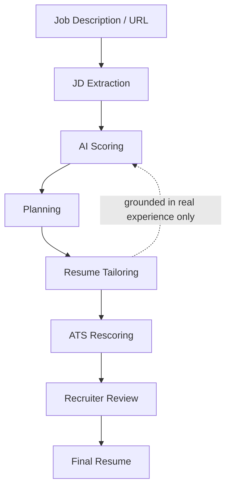

# Eleva — AI Career Operating System

> **Multi-stage resume optimization and ATS scoring pipeline** — paste a job description, and Eleva scores your resume, tailors it with honest-AI constraints, shows you the diff, and tracks the application.

**Live demo** → [eleva-beige.vercel.app/eleva](https://eleva-beige.vercel.app/eleva) · Blog post: [how the scoring works](https://ashish-chandan.vercel.app/blog/building-elevas-ats-pipeline)

## Why it exists

Job-search tooling either keyword-stuffs your resume or hands you a generic "AI rewrite" that fabricates experience. Eleva is built around a multi-stage pipeline that rewrites only what your real experience supports — and proves it with a structured ATS-style analysis.

## Architecture



## Key features

- **ATS parser simulation** — weighted keyword, formatting, and recruiter-signal analysis, not a keyword-count blender.
- **Multi-stage tailoring workflow** — paste JD → match analysis → tailored resume → review diff → apply & track.
- **Honest AI constraints** — rewrites restructure and re-emphasize *supported* facts only. Employers, titles, projects, degrees, and metrics must exist in the resume. Nothing is invented.
- **Provider-agnostic LLM routing** — requests route across providers with automatic fallback; rate limits fail over instead of failing the workflow.
- **Application kanban** — every application tracked from first touch to offer/rejection.

## Measured results

| Metric | Value |
| --- | --- |
| ATS score lift | 61 → 91 on the same resume |
| Keyword gaps fixed | 4 |
| Facts fabricated | 0 |
| Provider failover paths | 3× |

[Eval artifact](https://ashish-chandan.vercel.app/eleva-ats-eval.json) · methodology in the [scoring post](https://ashish-chandan.vercel.app/blog/building-elevas-ats-pipeline)

## Tech stack

- **Frontend** — Next.js, TypeScript, React, Tailwind CSS
- **Backend** — Next.js API routes, Supabase (auth, storage, Postgres)
- **AI** — LLM APIs with provider routing + fallback
- **Deployment** — Vercel

## Getting started

```bash
git clone https://github.com/chandu954/Eleva
cd Eleva
npm install
cp .env.example .env.local   # Supabase + LLM provider keys
npm run dev
```

## Roadmap

- [ ] LLM-as-judge eval harness for fabrication rate
- [ ] PDF resume upload (parse real layouts)
- [ ] Job tracker sync with email/linkedin exports